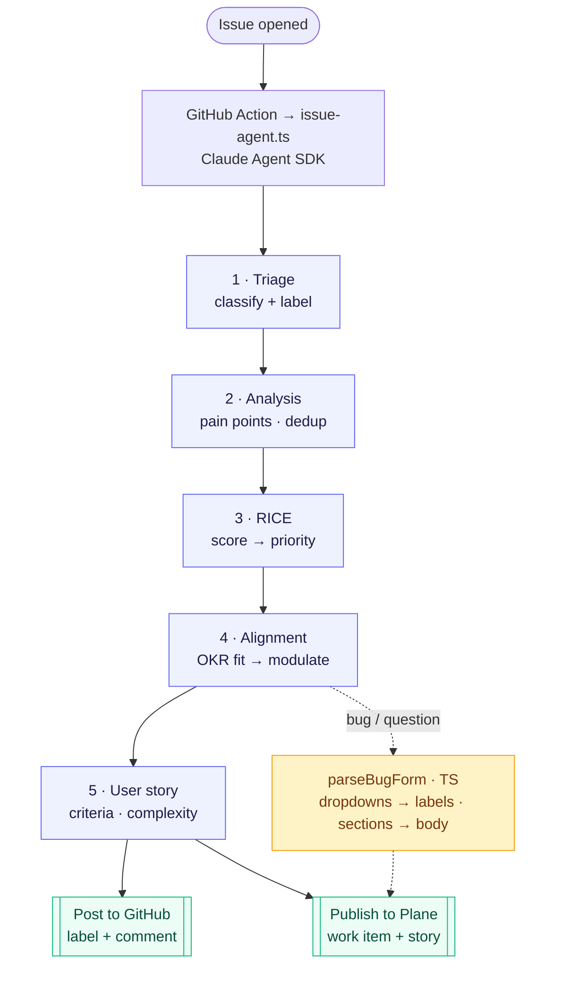

# Plane's PO Assistant

## A technical usecase of using an agent to unclutter the feedback pipe of an open-core product

Alexis Loiseau

---
layout: section
---

# Product context

**Plane**, an open-source alternative to Jira and Linear

---
layout: image-right
image: https://plane.so/_next/image?url=%2Fhome%2Fv4%2Fhero%2Fhero-desktop.webp&w=1920&q=75&dpl=dpl_BgEGqoNR9BiAD8c7AZhRK6Jq7PdW
backgroundSize: contain
---

# What is Plane?

### **Plane** is an open-source project & product management platform

Like its Jira or Linear competitors, it features:

- Work items (US, Epics...)
- Documentation / Wiki platform
- Workflows and integrations

---
layout: image-right
image: /plane-github.png
backgroundSize: contain
---

# An open-core SaaS

Open-core: when the core of a product is open-source

The team receives a ton of feedback from users, mostly in the form of Github issues.

- Some are bug reports, some are feature requests
- Most of them are structured with Github's issue template
- They use their own software to manage its development (dogfooding)

---
layout: section
---

# Problem identification

---

# The PO is drowning in inbound

<v-clicks>

- Every new Github issue implies a lot of work by hand
  - reading the issue, classify it (bug, feature, opportunity...), checking for duplicates
  - write complete user stories aligned with strategy
  - decide a priority, plan it
- The PO already has a lot of intakes to read, from different sources
  - they **won't** read yet another lengthy report
  - they already uses the "Intake" feature of Plane
  - they still want **control** on the backlog content
- That triage time is time _not_ spent on strategy, discovery,
  and talking to users.

</v-clicks>

<!--

Every new issue, email, or feedback ticket forces the PO to, by hand:

- **Read & classify**
- **Check for duplicates**
- **Guess a priority**
- **Re-write**
- **Re-decide**

In contexts where incoming user feedback volumes are huge (i.e. open source projects), this can take **few hours a week**.

That triage time is time *not* spent on strategy, discovery,
and talking to users.

-->

<!-----

# Gain time, not just more reports to read

### ✅ Automate the repetitive first pass

- Classify + label on arrival
- Detect likely duplicates
- Draft a first-pass RICE score
- Scaffold the user story & acceptance criteria
- Land it in the team's project management tool, ready to review

### ⛔ What not to do

- **Don't add a new tool to babysit** => meet the PO where work already lands
- **Avoid lenghty, full of slop reports** => the PO already has a lot to read
- **Don't auto-close issues** => keep the workflow safe and let the final word to the PO
- **Don't auto-push new work items** => we want to help the PO unclutter the pipe, not filling it with more items
- **No black-box scores** => every number is justified & inspectable

-->

<!--
The design north star: assist, don't replace. A wrong autonomous decision
costs more PO time than no decision at all — trust is the scarce resource.
-->

---
layout: section
---
# Demo Time !

---
layout: section
---
# Solution architecture

---

# The pipeline

<!--Each numbered step is an **isolated agent run** loaded with **one skill + a minimal tool allow-list**.
Bugs & questions **skip** Analysis and Story (dotted paths); a bug's form dropdowns are lifted into **Plane labels** and its prose into a titled body — **deterministically in TS**, like `adjustPriority`. Steps hand off via `/tmp/<step>.json`.-->

---

# Each step, and its skill

| #   | Step           | Skill                                   | Always?          | Produces                                  |
| --- | -------------- | --------------------------------------- | ---------------- | ----------------------------------------- |
| 1   | **Triage**     | —                                       | ✅               | type + confidence, applies GitHub label   |
| 2   | **Analysis**   | `user-feedback-synthesizer`             | feature/feedback | pain points, themes, duplicates           |
| 3   | **RICE**       | `feature-prioritization-assistant`      | ✅               | Reach×Impact×Conf/Effort → priority       |
| 4   | **Alignment**  | `plane-product-strategy` (custom skill) | ✅               | OKR fit 0–3 → modulates priority          |
| 5   | **User story** | `prd-writer`                            | feature/feedback | story + acceptance criteria + complexity  |
| 6   | **Publish**    | Plane MCP                               | ✅               | work item, labels, link, analysis comment |

 

- **One skill per step, minimal tools** => Focused context, cheaper runs, no cross-talk
- Dedicated skill for Product Strategy created from the project context
- Integrated with the user's previous tools & interfaces

---
layout: section
---
# Areas for improvement

---
layout: cover
---

# What I deliberately left out

<v-clicks>

- **Slack recap** -> I didn't wanted more noise
- **Agent memory** -> there is no real need for improvement between runs
- **GitHub issues only**
- **Bug reproduction / PR drafts**

</v-clicks>

---
layout: cover
---
# What to improve

<v-clicks>

- **Model / harness agnostic**
- **Cost per issue**
- **Advanced deduplication** -> Finding existing work items through RAG and referencing issues instead of creating a new item
- **Feedback loop** -> learn from PO edits to calibrate RICE & alignment
- **Contributor feedback** -> add Github labels, or automated messages that tells the contributor that this is taken into account

</v-clicks>

---
layout: section
---

# Questions ?

The repo is on Github <code>IT-ess/plane</code>.
 Agent's Code: <code>agent-scripts/issue-agent.ts</code>
  Workflow: <code>.github/workflows/issue-agent.yml</code>
