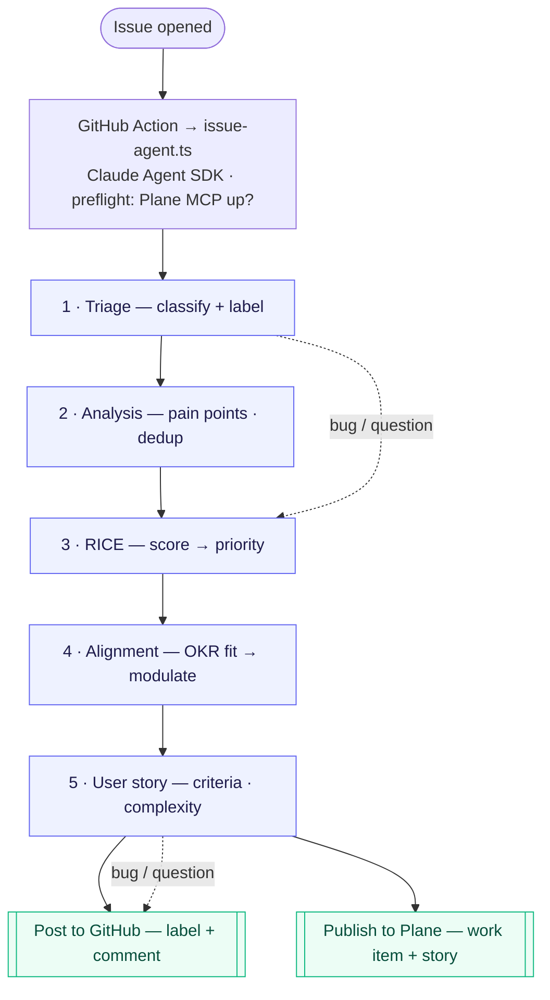

# PO Assistant

### An AI agent that pre-qualifies issues for the Product Owner

From a raw GitHub issue → a triaged, RICE-scored, strategy-aligned
work item in **Plane**, with a ready-to-use user story.

<!-- TODO: author name · role applied for · date -->
Technical test — AI assistant for a Product Owner

<!--
15-min slot. This deck is the 3-4 min "architecture & choices" backbone;
the live demo carries the rest.
-->

---
layout: section
---

# 1 · The problem

Where a Product Owner bleeds time — and how not to make it worse

---

# The PO is drowning in inbound

Every new issue, email, or feedback ticket forces the PO to, by hand:

- **Read & classify** — bug? feature? question? noise?
- **Check for duplicates** across the whole backlog
- **Guess a priority** — often gut-feel, rarely comparable
- **Re-write** a vague request into an actionable story
- **Re-decide** priorities every single day

The cost isn't any single issue — it's the **repetition**.

The same 15-minute ritual, dozens of times a week, on input of
wildly uneven quality.

That triage time is time *not* spent on strategy, discovery,
and talking to users.

<!--
Straight from the case brief: PO overwhelmed with feedback, feature
requests, and constant re-prioritization.
-->

---

# Gain time — without losing it elsewhere

### ✅ Automate the repetitive first pass

- Classify + label on arrival
- Detect likely duplicates
- Draft a **first-pass** RICE score
- Scaffold the user story & acceptance criteria
- Land it in the backlog, ready to review

The agent does the boring 80%. The PO edits, not authors.

### ⛔ What *not* to do (assumption)

- **Don't let the agent decide** — it *proposes*, the PO disposes
- **No black-box scores** — every number is justified & inspectable
- **Don't auto-close / auto-reject** issues
- **Don't over-automate** low-confidence cases into false certainty
- **Don't add a new tool to babysit** — meet the PO where work already lands

<!--
The design north star: assist, don't replace. A wrong autonomous decision
costs more PO time than no decision at all — trust is the scarce resource.
-->

---
layout: section
---

# 2 · Product context

Why the output lands in **Plane**

---

# What is Plane?

**Plane** is an open-source project & product management platform —
an alternative to Jira / Linear.

Its core objects are exactly what a PO works in:

- **Work items** (issues / stories / epics)
- **States**, **labels**, **priorities**
- **Intake** — a triage inbox for incoming items
- **Cycles**, modules, initiatives

### Why it fits this test

- A **real PM data model** to write into — not a toy sink (assumption)
- A first-class **MCP server** → the agent creates work items with tools, not brittle REST glue
- An **intake state** purpose-built to receive machine-triaged items for human review
- **Open source** → the whole workflow lives *in the repo* I forked, and the team can dogfood it

<!--
Plane isn't incidental: its MCP server + intake state are the two features
that make "agent → reviewable backlog item" clean instead of hacky.
-->

---
layout: section
---

# 3 · Solution architecture

One issue in → a reviewable work item out

---

# The pipeline

Each numbered step is an **isolated agent run** loaded with **one skill + a minimal tool allow-list**.
Bugs & questions **skip** Analysis and Story (dotted paths). Steps hand off via `/tmp/<step>.json`.

<!--
Walk it: trigger → orchestrator → fail-fast preflight → 6 skill-scoped steps
→ two sinks. The conditional skips keep cheap issues cheap.
-->

---

# Each step, and its skill

| # | Step | Skill | Always? | Produces |
|---|------|-------|---------|----------|
| 1 | **Triage** | — | ✅ | type + confidence, applies GitHub label |
| 2 | **Analysis** | `user-feedback-synthesizer` | feature/feedback | pain points, themes, duplicates |
| 3 | **RICE** | `feature-prioritization-assistant` | ✅ | Reach×Impact×Conf/Effort → priority |
| 4 | **Alignment** | `plane-product-strategy` | ✅ | OKR fit 0–3 → modulates priority |
| 5 | **User story** | `prd-writer` | feature/feedback | story + acceptance criteria + complexity |
| 6 | **Publish** | Plane MCP | ✅ | work item, labels, link, analysis comment |

The agent covers all three brief pillars — **feedback analysis**, **prioritization** (RICE + strategy),
and **assisted writing** — as separate, composable steps.

<!--
Map back to the brief's three feature categories explicitly.
-->

---

# Design choices that matter

**One skill per step, minimal tools**
Focused context, cheaper runs, no cross-talk — a step can't misuse a tool it was never given.

**File-based hand-off**
Isolated runs communicate through `/tmp/*.json` — each step is independently testable and replayable.

**Determinism guard**
The priority tier bump is **recomputed in TypeScript** (`adjustPriority`), never trusted from the LLM — the rule can't drift.

**Idempotent publish**
Dedup guard on `external_source / external_id` → re-running the workflow never creates duplicate work items.

**Fail-fast preflight**
Verifies the Plane MCP connects *before* spending 6 steps — no silent "success" with no output.

**Dogfooding**
Items are published into Plane's **own** Plane project — the team manages Plane with the agent.

<!--
These are the "engineering judgment" points — LLM where it adds value,
plain code where correctness must be guaranteed.
-->

---
layout: section
---

# 4 · Areas for improvement

Conscious scope for a demo — and where it goes next

---

# What I deliberately left out

### Cut for the demo (assumption)

- **Hardcoded** Plane project & intake-state IDs → would come from config / workspace lookup
- **Illustrative OKRs** in the alignment prompt → should be sourced from real product strategy
- **GitHub issues only** — no email / support-ticket / call-notes ingestion yet
- **One issue at a time** (`issues: opened`) — no backlog re-scoring or batch runs

### Natural next steps

- **Human-in-the-loop gate** — a review/approve step before priority is committed
- **Feedback loop** — learn from PO edits to calibrate RICE & alignment
- **Comparative prioritization** — score the *whole* backlog together, not per-issue in isolation
- **Eval harness** — regression tests on a labeled issue set (beyond `test-local.ts`)
- **Cost/latency budget** per issue

<!--
Frame these as choices, not gaps: each has a clear upgrade path. Shows I
know where the edges are.
-->

---
layout: center
class: text-center
---

# Recap

**GitHub issue → agent pipeline → reviewable Plane work item**

Assist, don't replace · every number justified · human keeps the call

<!-- TODO: repo link · Plane workspace link · demo issue link -->
Code: <code>agent-scripts/issue-agent.ts</code> · Workflow: <code>.github/workflows/issue-agent.yml</code>

